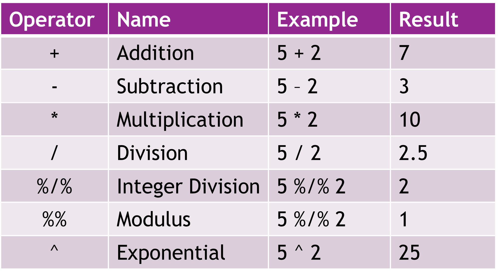
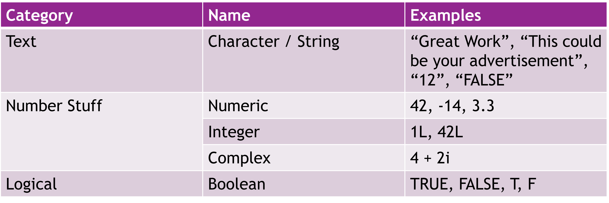
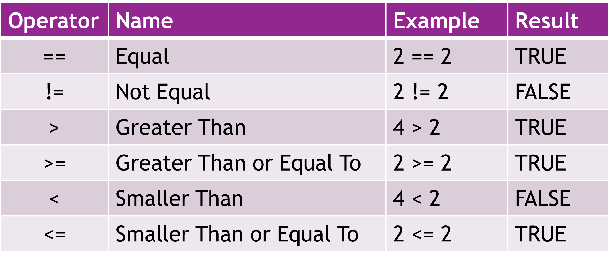
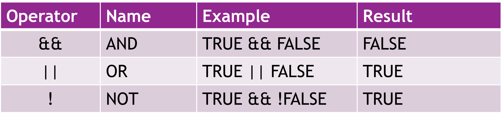
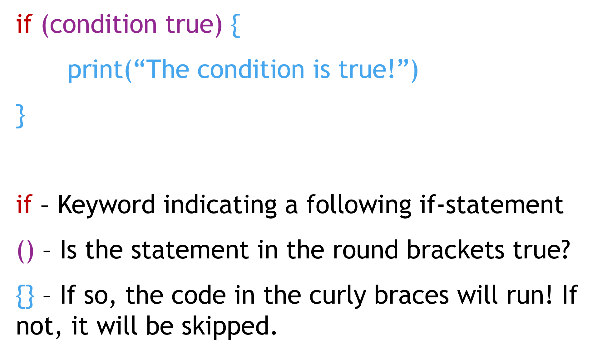
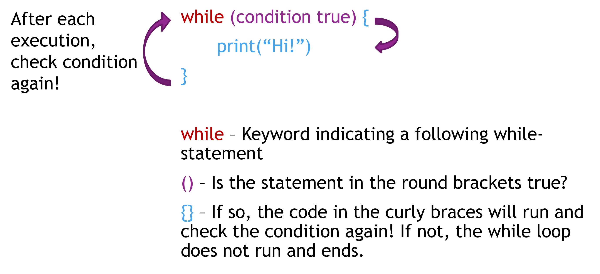
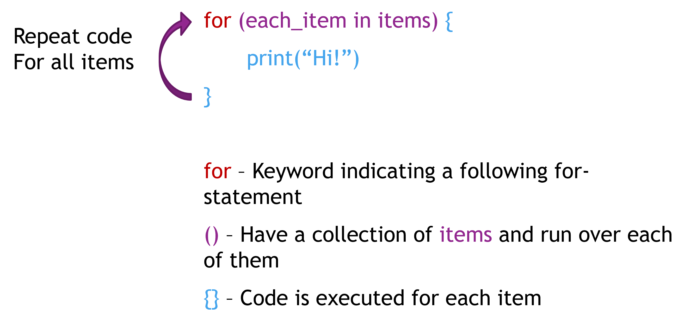

```{r setup, include=FALSE}
library(learnr)
gradethis::gradethis_setup()
knitr::opts_chunk$set(echo = FALSE)
```


## R - Basically just a Calculator

Let's start with the easiest application of R: As a simple calculator! No need to buy another one of those overpriced Casio-thingies anymore that you inevitably broke or lost after high school(EVEN THOUGH YOUR MOM TOLD YOU TO BE CAREFUL!), now you can just use the inconvenience of putting everything into code and hope for the best!

### Numeric Operators

R supports a decent number of basic numeric operators, as listed (or tabled?) below. Plus, minus, "times", you know the drill. We are going to shortly introduce all of them in code on this page, but if you've paid any attention in elementary school, you should have a basic awareness of most of them already.

```{r numOperators, echo = FALSE, out.width = "60%"}

```

### `+` - Addition

Remember addition? It's been a while.. Addition in R works as simple as on a calculator, just enter the numbers you want to add and a `+` in-between. So, to find the result to 5 plus 5, just write: `5 + 5` and run the code:

```{r five-plus-five, exercise=TRUE, exercise.eval=TRUE, include=FALSE}
5+5
```

It's your turn now! Write the code necessary to add 2 and 2!

```{r two-plus-two, exercise=TRUE}

```

```{r two-plus-two-solution}
2+2
```

```{r two-plus-two-code-check}
grade_code()
```


### `-` - Subtraction

Subtraction is like the opposite of addition (I guess?) and works similarly intuitive to addition. Just put a `-` in-between two numbers to subtract the second number from the first!

Just to annoy you, subtract 5 from 2 and see what happens!:

```{r five-min-two, exercise=TRUE}

```

```{r five-min-two-solution}
2-5
```

```{r five-min-two-code-check}
grade_code()
```

### `*` - Multiplication

If addition just doesn't cut it for you, you can reach large numbers faster using the magic of multiplication! 10000000, 399928532 or even 93856282347647 are just one click away, using the operator `*`!

As you're still unexperienced with R and I do not trust you to handle numbers in the millions safely yet, we will start with a low-risk multiplication. Multiply 5 by 4 and see what it results in!

```{r multiplication1, exercise=TRUE}

```

```{r multiplication1-solution}
5*4
```

```{r multiplication1-code-check}
grade_code()
```

### `/` - Division

If you've ever listened to a highly concerned news reporter on the TV, you will know that we live in divisive times. To divide societal groups, nations or just basic numbers, use the `/`-operator.

Let's divide the 20 from the previous exercise back into its original parts, so other students can re-use the task! Just divide 20 by 4 to get back 5!

```{r division1, exercise=TRUE}

```

```{r division1-solution}
20/4
```

```{r division1-code-check}
grade_code()
```

Have you ever dared to divide with a remainder? Yes? We'll do it anyway! Let's say you have 10 pieces of cake and 3 people to divide them up to, what would each of them get? Well, assumably diabetes, but how many pieces?

```{r division2, exercise=TRUE}

```

```{r division2-solution}
10/3
```

```{r division2-code-check}
grade_code()
```

### `%/%` - Integer Division and its `%%` - Remainder

Now, let's say you struggle with cutting your cake into an unnatural or irrational number of slices or just don't like to serve the fractional part (also called crumbs). R has got you covered by the use of Integer Division! Integer division basically only retrieves the integer part (so, everything before the comma). In regards to the cake this would mean: We do not further cut the cake, but only distribute the existing number of slices, so that each person has the same number of slices at the end. For integer division, we use the `%/%`-operator.

Go ahead and check how many slices each person would get in our previous example

```{r intDivision, exercise=TRUE}

```

```{r intDivision-solution}
10%/%3
```

```{r intDivision-code-check}
grade_code()
```

If you also want to know how many pieces of cake are left now, we can check the remainder using the `%%`-operator. Go ahead and check for the example above:

```{r intRemainder, exercise=TRUE}

```

```{r intRemainder-solution}
10%%3
```

```{r intRemainder-code-check}
grade_code()
```

Don't worry about the remaining piece of cake though, its fruit cake, no one wanted it anyway.

### `^` - Exponentials

Bored by the low numbers you got out of the multiplication task? Let's go crazy and do exponentials! We are going to skip the theory behind these and purely focus on the notification in R, using the `^`-operator. Let us simply raise 2 to the power of 8 and see the result:

```{r exponential, exercise=TRUE}

```

```{r exponential-solution}
2^8
```

```{r exponential-code-check}
grade_code()
```

### `sqrt()` - Square Roots

And again, to leave this practice sheet clean, we want to get our original 8 back! To get the square root from the previous example, we have to use the function `sqrt()` and put the result from the previous task inside the bracket. Go on and do this now!

```{r sqrt, exercise=TRUE}

```

```{r sqrt-solution}
sqrt(256)
```

```{r sqrt-code-check}
grade_code()
```

### Variables! (and comments. Also comments.)

If you work with lots of numbers, it makes sense for them to be saved in some way, like in a variable! Variables are ways of storing data in a dedicated place, accessible by the variable name. You can assign data to the variable, manipulate and update it dynamically! Let's look at an example

```{r variiiables, exercise=TRUE, exercise.eval=FALSE, include=FALSE}
x <- 5 # Assigning a 5 to x

print(x) # Prints the value assigned to x
x # Also prints the value, the print()-function above is optional

x <- x*x # re-assigning a different value to x!
x # Bwoah!
```

As you can see above, you can assign a value to a variable by first writing the variable name, here `x`, and then using an arrow  `<-` into the direction of the variable. On the right side you then put the value. As common in figuratively all other programming languages, you can also use the `=` instead of the arrow, but it is uncommon in R. You can also see in the examples that you can use the variables for calculations and re-assign them!

Two other things mentionworthy: We use the print function to print a value, three times even! This is possible by either just typing the variable name, or explicitly putting the `print()` function around it. Finally, to add comments to any code in R, use `#`! Anything in one line that is behind the waffle is ignored when running the code and is only there for us pityful humans to write and read extra info in the code! And no, just because it is a hashtag does not mean it is automatically posted to Twitter!

Some rules about naming variables:

* Variable names must start with a letter, usually a small letter.
* It cannot start with a number, but may include them in their name.
* Variable names are case senstitive, meaning: `mEaSuRe` and  `measurE` would be two different variables - albeit both horribly named!
* Some words are reserved for special purposes and cannot be used as variable names, like `null` `FALSE` `if` or `Persnickety`! Okay, the last one is made up, but still.
* It is seen as common to name variables using underscores, for example: `my_variable` or `important_data`, but conventions from other languages, like `myOtherVariable` are not false. Just choose whatever feels right - or whatever your boss tells you to feel right about!

## Data Types

R comes with multiple data types included, roughly categorizable into text/String, numbers and boolean logic. You can see the table of inherent data types including examples below. 

```{r dataTypes, echo = FALSE, out.width = "80%"}

```

As you can see, text is represented as the type "String", numbers are represented in three different fashions, numerics, integers and complex numbers, and logical values or booleans are their own types as well. Let's start unfolding the three types of numbers.

### Numeric

The numeric-type can be considered the main type of numeral representation and you'll almost exclusively use it. In fact, it is the type you have implicitly used in the previous calculator-section, already. If you define a variable with a pure number, the type will default to numeric if not specified elsewise, see:

```{r numeric1, exercise=TRUE, exercise.eval=FALSE}
# Any number!
x <- 1
class(x)

# Even decimals!
y <- 1.1
class(y)

# Or negative numbers! Bwoah!
z <- -6182
class(z)
```

### Integer

Integers are natural numbers (including negative numbers and 0) that can be defined by adding the letter `L` to the end of the number! You know, "L" like "integer"...

```{r integer1, exercise=TRUE, exercise.eval=FALSE}
x <- 1 # as numeric
x # Print value of x
class(x)

y <- 1L # as integer
y # Print value of y
class(y)
```

You can see that when the values are printed, no difference between the numeric 1 and the integer 1 are visible, so keep track of your types appropriately, or check them using `class()`.

### Complex

Complex numbers are... complex. We are not going to work further on with these, but be aware that they exist and can be created by adding an `i` to the imaginary part of the complex number. You know, "i" like complex, obviously not "i" like "integer"... 

```{r complex1, exercise=TRUE, exercise.eval=FALSE}
x <- 6i #Purely imaginary
x
class(x)

y <- 1 + 6i # Part real, part imaginary
y
class(y)
```

### Converting Data Types

Got an integer 5 for christmas, even though you really, really wished for a numeric one? Don't despair! Instead of sending it back to Amazon, where they'll just destroy it, you can just use `as.numeric()` to convert the integer 5 into a numeric type! Christmas is saved!

```{r convertingNumbers, exercise=TRUE, exercise.eval=FALSE}
# Integer 5, urgh
x <- 5L
x
class(x)
# Conversion in progress!
x <- as.numeric(x)
x
class(x)
```

This also works with other data types, so you could convert the number back to an integer type using `as.integer()` and we will see further options later on.


### Text: Strings / Characters

In R, the data type related to pure text is called "Character". This doesn't relate to its flamboyant personality, but rather to a text being a list of characters. However, basically all other programming languages, as well as most of the community surrounding R call it a "String", due to it being a string of characters. Strings can be defined by putting either `""` or `''` around your text. This also works for numbers, which are then simply saved as a string.

```{r strings1, exercise=TRUE, exercise.eval=FALSE}
x <- "This is some text"
x # Print text
class(x) # Check class of text

y <- 'So is this, though'
y
class(y)

z <- "4"
z
class(z)
```


Remember how you got that integer 5 for christmas last year? This year, you've wished for a string/character 4, but your brother actually got you a numeric 4, urgh. No issue though, because you've learned previously how to convert data types! Go ahead and convert the numeric 4 in x to a string/character in y!

```{r stringsTask, exercise=TRUE}
x <- 4
y <- # Add the right conversion function here!
class(y)
```

```{r stringsTask-solution}
x <- 4
y <- as.character(x)
class(y)
```

```{r stringsTask-code-check}
grade_code()
```


### String Magic!

There are lots of functions that allow you to work with Strings, manipulate them, combine them etc. We will only showcase some of them, but be aware that for whatever task you need a function, there is probably one and you will find it by simply googling what you need one for!

Sometimes you might need to find out how long a String is, for that you can use the `nchar()` function, which neatly checks the number of characters in a string. Do that below!

```{r nchar, exercise=TRUE}
x <- "This string has 30 characters!"
# check here!
```

```{r nchar-solution}
x <- "This string has 30 characters!"
nchar(x)
```

```{r nchar-code-check}
grade_code()
```

As you can see, empty spaces count as characters, so do special characters.

We are also going to look at how to connect two strings. One option for this is the `paste()`-function, which parses two strings!

```{r parsexample, exercise=TRUE, exercise.eval=FALSE}
x <- "Hello"
y <- "World"

z <- paste(x, y)
z # Show result!
```

You might or might not be surprised, but `paste()` by default puts a space between both strings, so it reads correctly! Neat!

Unless, of course, you don't want that space there. In the following task, we really want to shout hello to the world, so we want an exclamation mark, but no space between the World and the exclamation mark. There are multiple ways to do this and it is now your task to choose an appropriate one by googling something like "R string paste without space" or "R concatenate strings without space". Just see if you can find a solution that works for you and try to understand how it works!

```{r parsetest, exercise=TRUE}
x <- "Hello World"
y <- "!"
# Add function, so there is no space between x and y
```

```{r parsetest-solution}
x <- "Hello World"
y <- "!"
paste0(x,y)
```

```{r parsetest-check}
grade_result(
  pass_if(~identical(.result, "Hello World!"))
)
```

Many more string manipulation tools are at your disposal, but we will leave it at this for now!

### Booleans / Logic

The final type of data is booleans, or logical. These can hold exactly two values: `TRUE` or `FALSE`. Booleans are important later on for the logic of the code, for example to check if a statement you write is true and then run some code if and only if it is true. You will see this logic in action in the next section, for now let us look at defining booleans.

```{r boolample, exercise=TRUE, exercise.eval=FALSE, include=FALSE}
x <- TRUE
y <- T #Shorthand for TRUE
z <- FALSE
m <- F #Shorthand for FALSE

class(y)
y # Prints as TRUE
```

As you can see, the shorthands `T` and `F` can be used respectively to indicate TRUE or FALSE, which is a massive timesaver of course!

### Feeling empty? NA or NULL are your options!

Sometimes you might have values of data missing, either because they got lost in the mail, or because that stupid participant just refused to answer this harmless optional question about sensitive topics, grrrrrrrrr...

Don't despair! You can use either `NA` or `NULL` to represent empty or missing data. WHat's the difference? Well, let's check.

```{r nothing, exercise=TRUE, exercise.eval=FALSE, include=FALSE}
x <- NULL
y <- NA

class(x)
class(y)

x
y
```

It turns out that NA is a logical value, basically meaning that a logical value is neither `TRUE` nor `FALSE`. NULL on the other hand indicates something empty, it is its own thing. If you don't understand the implications, yeah, they go quite deep, just be aware of their existence and check which ones are appropriate for your specific use case. In case of missing values in a list or vector, for example, NA is usually the way to go.

## Conditions and If-Statements

### Comparison Operators

R supports the typical list of comparison operators, which compare values or variables on their content of truth, which leads us back to the booleans or logicals from the previous section. A comparison using comparison operators result in a boolean value, either `TRUE` or `FALSE`, depending on, well, whether the statement is true or false. The list of comparison operators can be seen below. 

```{r comparisonOperators, echo = FALSE, out.width = "80%"}

```

Let's see how these work in a real life example you will be too aware of: Human Height! Whether you're in an amusement park or on Tinder, you will be aware of the sign "You must be this tall to ride the attraction!". Using comparison operators, we can figure it out! 

Let's look at my actual height at age 9 as well as my height when standing on my toes and compare both to the requirements to ride the Colossos-roller coaster in the Heide Park.

```{r comparison1, exercise=TRUE, exercise.eval=FALSE, include=FALSE}
you_must_be_this_tall <- 140
my_height <- 137
standing_on_toes <- 140

# Am I at least this tall?
my_height >= you_must_be_this_tall
standing_on_toes >= you_must_be_this_tall
```

As you can see, to check whether I was AT LEAST the required height, we use the `>=`-operator. Turns out, I wasn't. However, standing on my toes I got into the ride. It was a blast and I've nearly fully recovered from the injuries! 

### Logical Operators

Using the comparison operators introduced above, we can only check one condition at a time. But what if we want to chain multiple conditions at once? Well, we do have Logical Operators for that! We can then chain multiple conditions using `&&` for AND or `||` for OR.

```{r logicalOperators, echo = FALSE, out.width = "80%"}

```

Let's look at an example from the world of online dating. Let's say that I see a profile on Tinder of a woman stating two requirements for her dating: She mentions that she is 1.78m tall and wants someone taller AND she really wants a guy who has brown hair. Using the magic of Logical Operators, we can check if I meet both of her requirements using `==`.

```{r comparison2, exercise=TRUE, exercise.eval=FALSE, include=FALSE}
woman_height <- 178
required_haircolor <- "brown"

my_height <- 184
my_haircolor <- "blonde"

my_height > woman_height # Am I tall enough?
my_haircolor == required_haircolor # Does my haircolor match?

my_height > woman_height && my_haircolor == required_haircolor # Am I tall enough AND does my hair color match?
```

So, while I am taller than her, as shown using `>`, my haircolor does not match the required one, which was checked using `==`. Evaluating the full statement using the `&&`-operator shows that I am not worthy of her. In terms of R, you can see that the haircolor was represented as strings. To check for equality, R just checks whether both strings contain the same characters, so whether the text is the same.

### If-Statements

So far, we have not really done anything with the result that is returned from out conditions, we just get a boolean value back. This is where we get to a bit of logic! If-Statements check If a conditional statement like the ones mentioned above is TRUE and then executes some code if it is. The general structure is as follows:

```{r ifStatement, echo = FALSE, out.width = "60%"}

```

Getting back to our Rollercoaster-example, we can now use an if-statement to check if someone is too small `<` to ride the roller coaster and ask them to leave the line.

```{r ifStatement1, exercise=TRUE, exercise.eval=TRUE, include=FALSE}
you_must_be_this_tall <- 140
my_height <- 137

if (my_height < you_must_be_this_tall) {
  print("Sorry kiddo, try the Merry-go-rounds!")
}
```

A small comment about style: While it is not strictly necessary, for ease of reading, code running within the squiggly brackets is shifted to the right, or "indented". That way you can easily spot which code belongs into the if-statement, without paying conscious attention to the brackets themselves.

### Else-Statements

In the if-statement above, if someone is taller than the required height, nothing happens. We can however also run certain code when the if-statement returns false by adding an `else`-statement afterwards.

```{r ifStatement2, exercise=TRUE, exercise.eval=TRUE, include=FALSE}
you_must_be_this_tall <- 140
standing_on_toes <- 140

if (standing_on_toes < you_must_be_this_tall) {
  print("Sorry kiddo, try the Merry-go-rounds!")
} else {
  print("You're tall enough, you can take the ride!")
}
```

Be aware that the `else`-statement only runs when the if-statement returns false, so it will never be both blocks of code running.

### Else If Statements

You can also run another if statement after the first one returns FALSE. for this, you just chain two if statements, using `else if` after the first one. This can be done as often as you like and it is also possible to end each of them with a final `else`-statement which runs in case none of the previous statements have returned true.

Let us for one final time return to the hurtful world of Tinder dating. A profile pops up with a woman saying "Hiiii, I am looking for someone who is at least 1.80m tall, I don't care about character, but please don't have black hair. Match me and I'll see if I like you. However, if you are toootally riiich, I don't care how you look and who you are, match me and write me instantly!"

Now, obviously no one is interested in this brat, but for the sake of it, let us look at the if statements leading to the decision on whether to match this person.

```{r ifStatement3, exercise=TRUE, exercise.eval=TRUE, include=FALSE}
my_height <- 184
my_haircolor <- "blonde"
me_being_rich <- FALSE

if (me_being_rich) {
  print("Match and write me!")
} else if (my_height > 180 && my_haircolor != "black") {
  print("Match, but I will write if you're worthy!")
} else {
  print("No! Just no!")
}
```

As you can see in the first if statement, if a variable is a boolean, we do not need to use a statement like `me_being_rich == TRUE`, we can just input the boolean itself, as it is already a truth value. The `else if` statement is then checked, as I am in fact not rich. Contrary to what we did before, we actually did not create separate variables here for the brat's preferences, but instead just put the number and the haircolor directly into the statement. As you can see, I do in fact suffice her requirements here, so the statement afterwards runs, which ends the if-chain and therefore the `else`-statement is not printed.

## Looping!

Additionally to if statement, there are so-called loops as logical elements, making it easier for you to code efficiently. Let's say you want to count the numbers from 1 to 5, you could annoyingly print all of them once after another:

```{r while0, exercise=TRUE, exercise.eval=FALSE, include=FALSE}
print(1)
print(2)
print(3)
print(4)
print(5)
```

It works, but it's a bit annoying, eh?

### While Loop

Use a while loop! Generally speaking, a while loop has the same structure as an if clause, and it does work surprisingly similar:

```{r whileExplanation, echo = FALSE, out.width = "60%"}

```

The while loop is indicated with the `while` keyword. Similar to the if clause, it first checks a conditional statement in the round brackets `()` and if it is true, it runs the body, the code in the squiggly ones `{}`. The difference arises to what happens after the code is run: It checks the conditional statement again, and if true, runs the body again! This, in theory, can go on forever, but usually some code in the body changes the statement in the conditional, which means that at some point it stops running.

For the counting from one to 5 we can write a while loop the following way:

```{r while1, exercise=TRUE, exercise.eval=FALSE, include=FALSE}
i <- 1 # Beginning number
while (i <= 5) {
  print(i) # Print current number
  i = i+1 # Add 1 to the number
}
```

As you can see above, we initiate the variable `i` at `1`. The while loop will then print `i` until it is above 5, in which case the conditional is false and the while loop stops working. Besides printing the number, we also add +1 to the current number saved in `i` in each round.

There is also a way to exit the while loop within the loop itself, using `break()`, which breaks out of the loop. So, regardless of whether the condition would continue to hold true, if a `break()` runs it will immediately end the while loop execution.

Let us test this by adding an if statement, which runs the `break()`-function whenever `i == 2`, so that the execution and therefore the printing of the numbers should stop after 2, instead of going up to 5. We also add two print statements to check whether the break happens immediately, or at the end of the whole run.

```{r while2, exercise=TRUE, exercise.eval=FALSE, include=FALSE}
i <- 1
while (i <= 5) {
  print(i)
  print("Before break")
  if (i == 2) {
    break()
  }
  print("After break")
  i = i+1
}
```

As you can see, the last printed statement is "Before break". This indeed means that the statement is exited immediately when the break runs. This also means that by placing the break()-function strategically within the code, you can decide which part of the code still runs. You can also see that you can easily add an if-clause to a while loop, which checks the if-statement during every loop! You could theoretically go on adding more loops and if statements within another, but at some point it will get difficult to distinguish what goes where, so try to avoid nesting these too much!

Now it's your turn again! Add an if-statement to the while loop below inducing a `break()`, so the loop exits whenever a number is dividable by 3. Hint: Remember the weird operators introduced at the very beginning of this workbook. Also, place the whole statement so that contrary to the example before, the number causing the break is not printed!

```{r whileTask, exercise=TRUE}
i <- 1
while (i <= 5) {
  print(i)
  i = i+1
}
```

```{r whileTask-solution}
i <- 1
while (i <= 5) {
  if (i %% 3 == 0) {
    break()
  }
  print(i)

  i = i+1
}
```

```{r whileTask-code-check}
grade_code()
```

What if we don't want to actually break the loop, but just want to skip certain numbers or executions of the loop? Why, we have the `next()` function for that, which conveniently skips over the rest of the code in the body/squiggly brackets, but instead of breaking the loop just goes on with the next iteration.

Now, write a while loop where instead of ending the loop, it just skips over those numbers dividable by three and only prints those that are NOT dividable by three. Make sure to use the `next()` keyword here to get some practice, even if there is an easier solution. Also, keep in mind that you need to increase the counter in `i` even when the number is not printed.

```{r whileTask2, exercise=TRUE}
i <- 1
while (i <= 20) {
  # code goes here :)
}
```

```{r whileTask2-solution}
i <- 1
while (i <= 20) {
  if (i %% 3 == 0) {
    i = i+1
    next()
  }
  print(i)
  i = i+1
}
```

```{r whileTask2-code-check}
grade_code()
```

### For Loop

If you find it annoying and unintuitive to always add `i+1` to iterate over basic numbers, there is another way to achieve it in an easier fashion: The for-loop! Instead of checking whether to continue with looping, you provide it with a collection or list of items (more about that later) and execute the code for each of them. The structure is as follows:

```{r forExplanation, echo = FALSE, out.width = "60%"}

```

Important here is what belongs in the round brackets: You have a collection of items and execute the code `for` each item `in` the collection, with `in` being a keyword used in R. Let us look at the example from before, printing all numbers from 1 to 5, as written in a for loop.

```{r for1, exercise=TRUE, exercise.eval=TRUE, include=FALSE}
x <- c(1, 2, 3, 4, 5) #A vector/list of items

for (i in x) {
  print(i)
}
```

You can see that we do not have to instantiate the variable i before the loop. Instead, by writing `i in x`, the variable `i` gets re-assigned to each item of the list with every iteration. You do not need to call it `i`, by the way, you can call it anything you really want. You've also seen your first list, or vector, in the wild. Vectors are created by putting the elements of your vector within `c()`. You know, "c", like "veCtor"!

It is also possible to completely abandon using the list, by instantiating a "range" of numbers using `1:5`. R allows you to create any kind of range this way, putting the starting number and the ending number around the `:`. You can then just use this range within the for loop as follows:

```{r for2, exercise=TRUE, exercise.eval=TRUE, include=FALSE}
for (i in 1:5) {
  print(i)
}
```

Contrary to most other programming languages, when you create a range `x:y`, both the starting number `x` and the ending number `y` are included in the range!

The same keywords `next` and `break` you have already seen in the while loop also apply in for-loops. Let's rewrite the while loop we've seen in the last while-task, where you had to print all numbers from 1 to 20, unless they were dividable by 3:

```{r forTask1, exercise=TRUE}
for () {

}
```

```{r forTask1-solution}
for (i in 1:20) {
  if (i %% 3 == 0) {
    next()
  }
  print(i)
}
```

```{r forTask1-code-check}
grade_code()
```


## Vectors

If you need a collection of items, whether that are Strings, numericals or booleans, you have a lot of options. lists, vectors, data frames, matrices. It depends on the type of data which one is preferable, but we are going to introduce maybe the most important two in this workbook: Vectors and Data Frames. For now, let's start with vectors, which we will lazily call lists from now on, and see how we define them!

```{r veclists, exercise=TRUE, exercise.eval=FALSE, include=FALSE}
vec1 <- c("This", "is", "a", "vector", "of", "strings")
vec1
class(vec1)

vec2 <- c(1, 2, 3, 4, 5)
vec2
class(vec2)
```

You can already see that the class of the vector depends on what type of values you put into it. This also means that vectors only allow one type of value to be put into each vector, you cannot for example mix strings and integers! If you want to do that for some reason, you need `list()`s, however usually this only applies in cases where you have a table of data, in which case data frames as presented in the next section are the way to go!

### Selecting Vector Elements by Position

If you want to only retrieve parts of the values in a vector, you have multiple ways of doing so! Generally, to access certain values in a vector ´x´, you put the information on what to access in rectangular brackets behind the vector name, so `x[]`. 

Let us first look at how accessing elements by position works. The most basic principle is: If you want to access a value in a position `i`, you indicate it by simply putting the value `i` in the square brackets, so `x[i]`. `x[3]` would therefore retrieve the third value in the vector `x`. This is different to most other programming languages, which start counting at 0, so 0 would retrieve the first value. In R, the number actually indicates the position, neat! Further, if you put a `-` before the number, you retrieve the vector WITHOUT the value in the position. Finally, you can retrieve a range of values in sequential or non-sequential positions by indicating your access-values as lists or ranges. An overview of how these accessing methods work can be seen below:

```{r veclists2, exercise=TRUE, exercise.eval=FALSE, include=FALSE}
x <- c("One", "Two", "Three", "Four", "Five")

x[3] # Retrieve third element
x[-2] # Retrieve all but the second element
x[2:4] # Retrieve elements 2 to 4
x[-(2:4)] # Retrieve all elements but 2 to 4
x[c(1,4)] # Retrieve elements 1 and 4
```

Time for a practice session! You're planning a Christmas party for your family and already have the whole family neatly saved in a list of names. However, you find out that Uncle Ned has made a comment 5 years ago on an internet platform which slightly misaligns with your political opinions, which are obviously morally superior! By all means, you now have to cut him, his wife and his children out of the invitee-list:

```{r vectest1, exercise=TRUE}
invitees <- c("Mom", "Dad", "Dog", "Hamster", "Ned", "Neds Wife", "Neds Son", "Neds Daughter", "Joanne (Wait, who is Joanne again?)")

# Kick Ned's family out here!
```

```{r vectest1-solution}
invitees <- c("Mom", "Dad", "Dog", "Hamster", "Ned", "Neds Wife", "Neds Son", "Neds Daughter", "Joanne (Wait, who is Joanne again?)")

invitees[-(5:8)]
```

```{r vectest1-check}
grade_result(
  pass_if(~identical(.result, c("Mom", "Dad", "Dog", "Hamster", "Joanne (Wait, who is Joanne again?)")))
)
```

Christmas is saved!

### Accessing Vector elements by value!

You might have realized that it was quite annoying to check out which positions Ned's family was in. Wouldn't it be easier to just tell R to cut out Teds family, regardless of the position in the list? It's possible! Let us first look at how to just throw out Ned by value

```{r veclists3, exercise=TRUE, exercise.eval=FALSE, include=FALSE}
invitees <- c("Mom", "Dad", "Dog", "Hamster", "Ned", "Neds Wife", "Neds Son", "Neds Daughter", "Joanne (Wait, who is Joanne again?)")

invitees[invitees != "Ned"] # Retrieves all people that aren't equal to Ned
```

Nice, but this obviously does not cover his family. What we can do however is to create a separate list with his family and take the values out of the invitee-list:

```{r veclists4, exercise=TRUE, exercise.eval=FALSE, include=FALSE}
invitees <- c("Mom", "Dad", "Dog", "Hamster", "Ned", "Neds Wife", "Neds Son", "Neds Daughter", "Joanne (Wait, who is Joanne again?)")

not_invited <- c("Ned", "Neds Wife", "Neds Son", "Neds Daughter")

invitees[!(invitees %in% not_invited)] # Throws all family members %in% the not invited list out!
```

Wait, what is happening here? Let us first check the term `invitees %in% not_invited` more clearly:

```{r veclists5, exercise=TRUE, exercise.eval=FALSE, include=FALSE}
invitees <- c("Mom", "Dad", "Dog", "Hamster", "Ned", "Neds Wife", "Neds Son", "Neds Daughter", "Joanne (Wait, who is Joanne again?)")

not_invited <- c("Ned", "Neds Wife", "Neds Son", "Neds Daughter")

invitees %in% not_invited
```

The term retrieves its own list, a list of booleans in the same order as the `invitees`-list. When a value is in both of the lists, it turns true, else it turns false. if we just used this expression, we would keep Ned's family and discard everyone else, what a horrible mistake! Therefore we use the `!` to turn all values within the list of booleans around. The expression `!(invitees %in% not_invited)`therefore neatly keeps everyone who is NOT in the list of uninvited people.

### Neat methods for Vectors

Again, a large amount of methods are available to work with vectors! Let's look at some of the most useful ones. The first one is `sort()`, which allows you to sort a list in case you accidentally dropped one and it is completely unsorted...

```{r veclistssort, exercise=TRUE, exercise.eval=FALSE, include=FALSE}
x <- c(3, 5, 1, 2, 4)
y <- c("Vatican", "Andorra", "Liechtenstein", "Apple")

sort(x)
sort(y)
```

As you can see, numbers are sorted by increasing them, while Strings are sorted alphabetically, from A to Z.

To give you a small task which requires some research on your part: Try to sort the following list in reverse order, from A to Z. Don't be afraid to google, it is quite a simple task!

```{r vecsort1, exercise=TRUE}
x <- c("done", "by you!", "Wow,", "very well")

# Reverse sort here!
```

```{r vecsort1-solution}
x <- c("done", "by you!", "Wow,", "very well")

sort(x, decreasing = TRUE)
```

```{r vecsort1-check}
grade_result(
  pass_if(~identical(.result, c("Wow,", "very well", "done", "by you!")))
)
```

Another neat option is to check the length, so the number of items in a vector. This is fittingly done with the `length()` method, applied in the same way as the sort-function above. I will immediately leave it up to you to apply it:

Remember how you're still planning this Christmas dinner thing with your family? You've decided to get Pizza for... reasons. You have to now figure out how many Pizzas to order, assuming one pizza per person:

```{r pizzaman, exercise=TRUE}
invitees <- c("Mom", "Dad", "Dog", "Hamster", "Joanne (Wait, who is Joanne again?)")

# Find out the number of people in the list!
```

```{r pizzaman-solution}
invitees <- c("Mom", "Dad", "Dog", "Hamster", "Joanne (Wait, who is Joanne again?)")

length(invitees)
```

```{r pizzaman-check}
grade_result(
  pass_if(~identical(.result, 5L))
)
```

Finally, we don't just want to be able to delete certain elements in a vector, we also want some to be replaced. For this, we need to use our knowledge about accessing specific elements within a vector and then simply re-assign other values to them. For example:

```{r replaceme, exercise=TRUE, exercise.eval=FALSE, include=FALSE}
x <- c(1, 2, 3, 4, 5)

x[3] <- 100 # Replacing the third element
x

x[3:5] <- c(77, 88, 99) # Replacing the third to fifth element with a list
x

x[2:4] <- -55 # Replacing multiple elements with one number!
x
```

As you can see in the first example, you can simply replace one element with another. You can also see that you can replace multiple ones at once with a whole list of elements! Finally, if you assign one value to multiple elements, all of them will have the same value!

To test how well you're remembering the accessing possibilities presented before, you will now put a final touch on the Christmas preparations! Everyone has handed in their wishes for what they want on their Pizza for Christmas, however some of them have seriously chosen Pineapple. PINEAPPLE! Now, it is too late to uninvite them, so we simply have to replace their pineapple-topping wish in the grocery list with some extra cheese, cause that is the objectively right thing to do!

```{r pinoapple, exercise=TRUE}
# Grocery List Vector
x <- c("Cheese", "Pineapple", "Tuna", "Onion", "Basil", "Cheese", "Garlic", "Extra Garlic", "Onion", "More Garlic", "Cheese", "Pineapple", "Meat", "Tomato", "No Cheese", "Pineapple", "Really, I don't want cheese", "Onion", "Seriously, I can't process cheese, do not give me cheese!", "Meat", "Paprika", "Tomato")


replacement <- "Extra Cheese!"

# Now, replace all Pineapple's with the extra cheese!

x
```

```{r pinoapple-solution}
x[x == "Pineapple"] <- replacement

x

```

```{r pinoapple-check}
grade_result(
  pass_if(~identical(.result, c("Cheese", "Extra Cheese!", "Tuna", "Onion", "Basil", "Cheese", "Garlic", "Extra Garlic", "Onion", "More Garlic", "Cheese", "Extra Cheese!", "Meat", "Tomato", "No Cheese", "Extra Cheese!", "Really, I don't want cheese", "Onion", "Seriously, I can't process cheese, do not give me cheese!", "Meat", "Paprika", "Tomato")))
)
```

## Final Quiz!

Let's see how well you're doing on completely meaningless, but fun multiple choice questions!

```{r quiz}
quiz(caption="Basic Calculator Stuff!",
  question("How do you multiply 3 times 4 in R?",
    answer("`3 times 4`", message="That would be a bit too easy, wouldn't it? :)"),
    answer("`3 x 4`", message = "No, x can be used as a variable name"),
    answer("`3 * 4`", correct = TRUE),
    answer("`3 + 3 + 3 + 4`", message="Same result, but not multiplication!"),
    allow_retry = T,
    random_answer_order = TRUE
  ),
  
  question("Which operator is used for Floor Division",
    answer("`%%`", message="`%/%` would be the remainder from the Floor division!"),
    answer("`//`", message="`//` doesn't exist, I'm afraid :)"),
    answer("`%/%`", correct = TRUE),
    answer("`floor()`", correct=TRUE),
    correct = "Turns out that `floor()` is actually a second option to achieve the same :) Trick question!",
    allow_retry = T,
    random_answer_order = TRUE
  ),
  
  question("Which of these are correct variable names?",
    answer("my_variable_1", correct = TRUE),
    answer("_variable_1", message="You cannot start a variable name with an underscore."),
    answer("1st_variable", message="Do not start a name with a number!"),
    answer("my_variable", correct = TRUE),
    allow_retry = T,
    random_answer_order = TRUE
  )
)
```

```{r quiz2}
quiz(caption="Data Types in R!",
  question("How do you turn the numeric `55` into a String?",
    answer("`string(55)`"),
    answer("`as.string(55)`", message = "Don't forget that R does not call Strings Strings, urgh."),
    answer("`as.character(55)`", correct = TRUE),
    answer("`55.toString()`"),
    allow_retry = T,
    random_answer_order = TRUE
  ),
  
  question("How do you combine two strings `x` and `y` (with a space separating them)?",
    answer("`x + y`", message="Urgh, I wish they finally implemented that..."),
    answer("`parse(x,y)`", ),
    answer("`paste(x,y)`", correct = TRUE),
    answer("`concat(x,y)`"),
    correct = "Turns out that `floor()` is actually a second option to achieve the same :) Trick question!",
    allow_retry = T,
    random_answer_order = TRUE
  ),
  
  question("Which of these are correctly written boolean states?",
    answer("TRUE", correct = TRUE),
    answer("False", message="R is case sensitive, check the capitalization!"),
    answer("Right", message="Right, which is, ironically, wrong, heh."),
    answer("F", correct = TRUE),
    allow_retry = T,
    random_answer_order = TRUE
  )
)
```

```{r quiz3}
quiz(caption="Conditional Statements",
  question("If you either get at least 2 out of the following three questions correct, or you are not following the rules, you can continue with the next quiz. Which logical statement reflects this?",
    answer("`number_correct > 2 || !rules`"),
    answer("`number_correct >= 2 !& rules`"),
    answer("`number_correct >= 2 || !rules`", correct = TRUE),
    answer("`number_correct < 2 && !rules`"),
    allow_retry = T,
    random_answer_order = TRUE
  ),
  
  question("What was the right order of those weird brackets in an IF Statement again?",
    answer("`if()[]`", ),
    answer("`if[]{}`", ),
    answer("`if(){}`", correct = TRUE),
    answer("`if{}()`"),
    allow_retry = T,
    random_answer_order = TRUE
  ),
  
  question("Which comparisons would always lead to opposite outcomes than `x <= 4`",
    answer("x > 4", correct = TRUE),
    answer("x != 4"),
    answer("x >= 4", message="Careful, in case x equals 4, both would now turn out positive!"),
    answer("4 < x", correct = TRUE),
    allow_retry = T,
    random_answer_order = TRUE
  )
)
```

```{r quiz4}
quiz(caption="Loopings!",
  question("How can you get out of a while loop?",
    answer("The condition turns out FALSE", correct = TRUE),
    answer("A `break`-statement breaks out of the loop", correct = TRUE),
    answer("You throw the PC out of the window!", message="No, even then the while loop will continue running in your head and haunt you in your sleep!"),
    answer("A `next` statement runs the next part of the code", message = "The next statement only starts the next iteration in the loop"),
    allow_retry = T,
    random_answer_order = TRUE
  ),
  
  question("Which of the following for loops has the correct structure?",
    answer("`for i in 1:10:`", ),
    answer("`for (1:10){}`", ),
    answer("`for (i in 1:10){}`", correct = TRUE),
    answer("`for (i,1,10){}`"),
    allow_retry = T,
    random_answer_order = TRUE
  )
)
```

```{r quiz5}
quiz(caption="Vectors!",
  question("How do we instantiate a vector?",
    answer("`v()`"),
    answer("`vector()`"),
    answer("`c()`", correct=T),
    answer("Google: How to instantiate vector in R?", message = "Yes, but no."),
    allow_retry = T,
    random_answer_order = TRUE
  ),
  
  question("A secret stash of `5`s has been hidden in the second to ninth position of vector `numerical_treasure`! Quick, retrieve it!",
    answer("`numerical_treasure[c(2,9)]`", ),
    answer("`numerical_treasure[1:8]`", message="Wrong language :)"),
    answer("`numerical_treasure[2:9]`", correct = TRUE),
    answer("`numerical_treasure(2,9)`"),
    answer("I don't care for those primitive `5`s, I'm more of a complex, irrational numbers guy...", message="Yeah, that's what they all say, but at the end of the day, they're all enjoying their fours, twos and elevens. DISMISSED."),
    allow_retry = T,
    random_answer_order = TRUE
  ),
      question("How do you get the number of elements in vector `x` again?",
    answer("len(x)"),
    answer("len x"),
    answer("length(x)", correct=T),
    answer("size(x)"),
    allow_retry = T,
    random_answer_order = TRUE
  ),
  question("Which topping does NEVER EVER belong on a pizza?",
    answer("Pineapple!!!!!!!!", correct = TRUE),
    answer("Cheese", message = "LEAVE THE CLASS, NOW!"),
    answer("Basil"),
    answer("Tuna", message = "I respectfully disagree"),
    allow_retry = T,
    random_answer_order = TRUE
  )

)
```